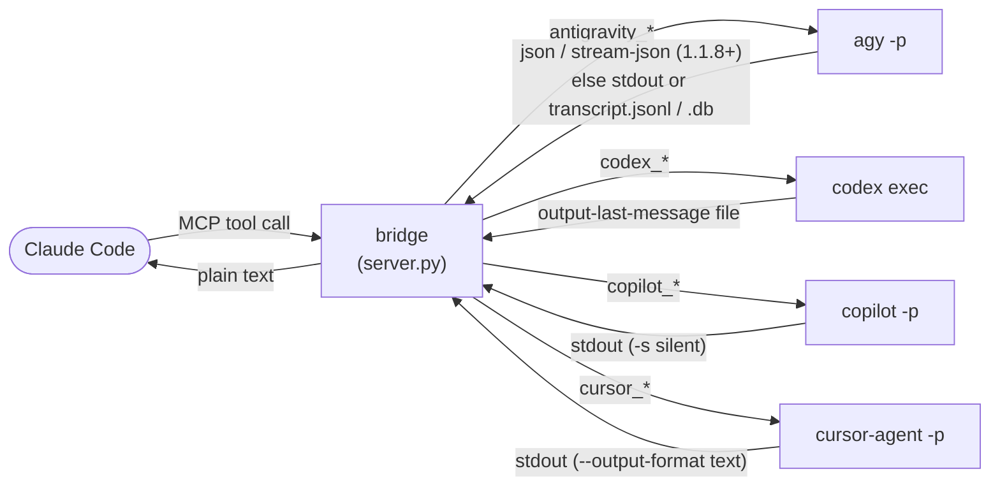

<div align="center">

# Claude Code × Antigravity + Codex + Copilot + Cursor — MCP Bridge


**Drive five external coding CLIs — Google's [Antigravity](https://antigravity.google/) (Gemini 3.6 Flash), [OpenAI Codex](https://developers.openai.com/codex/), the [GitHub Copilot CLI](https://docs.github.com/en/copilot/how-tos/copilot-cli), [Cursor](https://cursor.com/cli), and [Claude Code](https://claude.com/claude-code) itself — as sub-agents inside [Claude Code](https://claude.com/claude-code). Text answers, image generation, real repo work, and parallel swarms, on quota you already pay for.**

[](https://github.com/SinanTufekci/agent-intern/actions/workflows/ci.yml)
[](https://pypi.org/project/agent-intern/)
[](https://pepy.tech/projects/agent-intern)
[](LICENSE)
[](https://www.python.org/)
[](https://modelcontextprotocol.io/)
[](https://glama.ai/mcp/servers/SinanTufekci/agent-intern)
[](https://antigravity.google/)
[](https://developers.openai.com/codex/)
[](https://docs.github.com/en/copilot/how-tos/copilot-cli)
[](https://cursor.com/cli)
[](#requirements)
[](https://github.com/sponsors/SinanTufekci)

</div>

---

One MCP server, **five backends**. It exposes Google Antigravity, OpenAI Codex, the GitHub
Copilot CLI, Cursor, and Claude Code itself to Claude Code as clean MCP tools so you can delegate work
to a different model family mid-task — without leaving your terminal, and on the subscriptions you
already have. Each backend is independent: install one, two, three, four, or all five.

- **🛰️ Antigravity (`agy`, Gemini 3.6 Flash High).** Fast, cheap tool-calling — and the **only**
  backend with an image model. Its headless print mode (`agy -p`) historically had a **stdout bug**:
  it wrote the answer to the *controlling terminal* instead of its stdout, so anything capturing
  stdout got nothing (and, under a TUI, agy's text leaked into the host's prompt). **agy 1.0.15 fixed
  this on Windows** — `-p` now writes the clean answer to stdout — so the bridge **prefers stdout** and
  falls back to reading agy's *own* transcript files only when stdout is empty (older agy, non-Windows,
  or `--sandbox` runs). It still **detaches agy from the terminal** so older versions can't leak.
- **🤖 Codex (`codex exec`, OpenAI).** A strong reasoner for real code/repo work. It writes its final
  message straight to a file the bridge asks for (no scraping), supports **model selection**, and has
  a **real, enforced sandbox**.
- **🐙 Copilot (`copilot -p`, GitHub).** GitHub's agentic coder. Stdout-native like Codex (`-s`
  prints just the answer), with **model selection** (`--model`), a **best-effort** tool/path
  permission knob, and a deterministic resume mechanism (the bridge sets each session's UUID itself).
- **✳️ Cursor (`cursor-agent -p`, Cursor).** Cursor's agentic coder, with the **widest model menu** —
  GPT, Claude, Grok, and Composer via `--model` (validated against `cursor-agent models`). Stdout-native
  like Codex/Copilot (`--output-format text` prints just the answer), an **agent-enforced** sandbox
  (read-only via `--mode ask`), and a deterministic resume mechanism (the bridge mints each chat's id
  itself via `create-chat`). No image model.
- **⚡ Claude (`claude -p`, Claude Code).** The Claude Code CLI itself, headless. **Automode by
  default** (`sandbox="default"` = explicit `--permission-mode auto`). `model` picks the backend — an
  Anthropic alias/id uses the plain `claude` binary on this Anthropic account, while a **claude-os
  harness id** (`ds-flash`, `ds`, `k3`, …) runs through the `claude-os` wrapper on that provider's
  quota (DeepSeek/Kimi/Z.AI). Reads the answer from stdout JSON (`--output-format json`), resumes by a
  pinned session id (`--resume <id>`, else `--continue`), and has a **tool-level** permission boundary
  — not an OS sandbox.

All five share the same niceties: a `*_continue` to resume a thread, a [live "watch" window](#watch-mode)
to see the agent work, a unified [`agent_swarm`](#swarm) that runs many tasks in parallel **across
all backends at once**, and `*_status` diagnostics that spend no quota.

> [!WARNING]
> **This runs unsandboxed code with your privileges.** `agy -p` auto-executes its tools
> (read/write files, run shell commands, reach the network) with **no usable approval gate** — its
> `--sandbox` blocks only *shell commands*, leaving file writes and network egress wide open.
> `codex exec` also runs autonomously, but its `sandbox` flag (default `read-only`) **is** a real,
> enforced boundary. `copilot -p` runs headless with `--allow-all-tools`; its `sandbox` maps to
> **best-effort** tool/path permissions (read-only denies the local write/shell tools) — safer than
> agy, but **not** an OS sandbox like Codex's. `cursor-agent -p` runs headless with `--trust` (and
> `--force` for writes); its `sandbox` is **agent-enforced** (read-only = `--mode ask`, which makes the
> write/shell tools unavailable) — best-effort like Copilot, **not** an OS sandbox. In all five cases
> the `workspace` argument is a *starting context*, **not** a security boundary. Only use these with **trusted prompts on trusted
> content**; for real isolation, run the bridge inside a container or VM. **[Full details →](#security)**

## Why you'd want this

| | |
|---|---|
| 🧠 **Second opinion** | Ask a different model family — Gemini *or* GPT — mid-task without switching tools. |
| 🎨 **Image generation** | Have Gemini draw an image and get the saved file back — no extra API key or image tool. |
| 🛠️ **Real coding sub-agent** | Hand a focused repo task to Codex with a real `workspace-write` sandbox. |
| 💸 **Cheap delegation** | Burn Antigravity / Codex quota on grunt work instead of Claude tokens. |
| 🐝 **Parallel fan-out** | Run N tasks at once, mixing Gemini and Codex workers in a single swarm. |
| 📁 **Cross-repo reads** | Point a worker at another project directory and let it read/answer there. |
| 🔌 **Zero new auth** | Piggybacks the logins you already did — no keys for the bridge to manage. |

## The five backends at a glance

The bridge normalizes all five CLIs into the same shape, but they differ where it matters. Pick per task:

| | 🛰️ **Antigravity** (`agy`) | 🤖 **Codex** (`codex exec`) | 🐙 **Copilot** (`copilot -p`) | ✳️ **Cursor** (`cursor-agent -p`) | ⚡ **Claude** (`claude -p`) |
|---|---|---|---|---|---|
| **Model** | Selectable via `model` (agy's `--model`); Gemini 3.6 Flash (High) default (see [Model & auth](#model--auth)) | Selectable via `model` (codex's `-m`) | Selectable via `model` (`--model`) | Selectable via `model` (`--model`), validated against `cursor-agent models` | Selectable via `model` — an Anthropic alias/id (plain `claude`) or a claude-os harness id (`ds-flash`, `k3`, …) routing to DeepSeek/Kimi/Z.AI |
| **Best at** | Fast, cheap tool-calling; quick answers | Heavier reasoning; real code/repo work | Agentic coding; real code/repo work | Agentic coding; wide model menu (GPT/Claude/Grok/Composer) | Your own Claude Code, headless; automode by default; any claude-os provider/model |
| **Image generation** | ✅ `antigravity_image` (+ `antigravity_image_swarm`) | ❌ no image model | ❌ no image model | ❌ no image model | ❌ no image model |
| **Sandbox** | ❌ no real boundary (`--sandbox` blocks only shell) | ✅ real, enforced: `read-only` / `workspace-write` / `danger-full-access` | ⚠️ best-effort: tool/path permissions (`read-only` denies write/shell) — **not** an OS sandbox | ⚠️ agent-enforced: mode/force (`read-only` = `--mode ask`, write/shell tools unavailable) — **not** an OS sandbox | ⚠️ tool-level permission modes (`default` = automode; `read-only` = dontAsk allowlist; `workspace-write` = acceptEdits) — **not** an OS sandbox |
| **How the answer is read** | `--output-format json` on agy 1.1.8+ (`stream-json` when watching); else stdout, else scraped from `transcript.jsonl` | Written to a file via `-o/--output-last-message` | stdout (`-s` silent mode) | stdout (`--output-format text`) | stdout JSON via `--output-format json` (`stream-json` when watching) |
| **Continue mechanism** | Pins the workspace's conversation id (`--conversation`) | Resumes the session id (`codex exec resume <id>`) | Resumes a self-set session UUID (`--session-id`) | Mints a chat id (`create-chat`) and resumes it (`--resume <id>`) | Resumes the pinned session id (`--resume <id>`), else `--continue` |
| **Auth** | OS credential store (AI Pro session) | `codex login` (ChatGPT account or API key) | OS credential store (`copilot login`) or a GitHub token env | `cursor-agent login` (OS credential store) or `CURSOR_API_KEY` | `claude auth status` — OAuth (`~/.claude/.credentials.json`) or `ANTHROPIC_API_KEY`; harness models need their token env (`DEEPSEEK_API_KEY`, …) |
| **In a swarm** | Runs with an isolated `HOME` to avoid state races | Fresh one-shot — needs no isolation | Fresh one-shot — needs no isolation | Fresh one-shot — needs no isolation | Fresh one-shot — needs no isolation |

## How it works

All five backends run **headless** and one-shot per call; the bridge's job is to get a clean answer
out of each and hand it to Claude Code as a plain string.



**Antigravity.** On agy **1.1.8+** the bridge asks for structured output and reads a contractual
field instead of guessing: plain calls use `--output-format json` and return its `response`, while
[watch mode](#watch-mode) uses `--output-format stream-json` and rebuilds the answer from the stream's
terminal `result` event (the same shape the [Cursor bridge](#cursor) already used). Both also carry a
`conversation_id`, which the bridge records so `antigravity_continue` pins **exactly** the thread it
last ran in that workspace.

Older agy has no such flag, so the original path stays: on **1.0.15+** (Windows) `agy -p` writes its
clean answer to stdout and the bridge returns that; on older agy — or non-Windows, or a `--sandbox`
run — stdout is empty and the bridge falls back to agy's own transcript at:

```
~/.gemini/antigravity-cli/brain/<conv-id>/.system_generated/logs/transcript.jsonl
```

For that fallback it locates the conversation via `cache/last_conversations.json` (falling back to the
newest `brain/` directory touched since launch), streams the transcript, and returns the final
`source=MODEL, status=DONE, type=PLANNER_RESPONSE` entry — the answer, minus the intermediate
tool-calling steps (or the SQLite `.db` agy dual-writes, when no JSONL exists). This fallback still
runs on 1.1.8+ whenever a run yields no `result`, so nothing depends on the structured path alone.

**Codex.** `codex exec` is well-behaved: the bridge passes `-o/--output-last-message <file>` and
codex writes its final message straight there — no scraping. Continue works by capturing the session
id from codex's own rollout files (`~/.codex/sessions/.../rollout-*.jsonl`) and resuming with
`codex exec resume <id>`, falling back to the newest on-disk session for that cwd after a server
restart.

**Copilot.** `copilot -p "<prompt>" -s` runs a prompt non-interactively and prints the clean final
answer to stdout — the bridge reads it there, no scraping. It runs headless with `--allow-all-tools
--no-ask-user --no-auto-update` (so it never blocks on a prompt), and disables copilot's flaky
builtin GitHub-API MCP by default for predictable latency (`COPILOT_GITHUB_MCP=1` re-enables it).
Continue is **deterministic**: copilot's `--session-id <uuid>` both *sets* a new session's id and
*resumes* an existing one, so the bridge generates the UUID itself, pins it to the workspace, and
resumes that exact session — falling back after a restart to the newest on-disk session
(`~/.copilot/session-state/<id>/workspace.yaml`) whose recorded `cwd` matches.

**Cursor.** `cursor-agent -p --output-format text --trust "<prompt>"` runs a prompt non-interactively
and writes the clean final answer straight to stdout — the bridge reads it there, no scraping
(`--trust` trusts the workspace so it never blocks on a prompt). Continue is **deterministic and
race-free**: `cursor-agent create-chat` mints a fresh chat and prints its id, so the bridge mints the
id itself, pins it to the workspace, and resumes that exact chat with `-p --resume <chatId>` — no
rollout-scraping. After a restart it falls back to the newest on-disk chat under
`~/.cursor/chats/<md5(workspace)>/<chat-id>/` whose `meta.json` `cwd` matches (the chat-dir hash is
itself md5 of the workspace path).

## Set up in 60 seconds

**Prerequisites — install whichever backend(s) you want, and sign in once each:**

- **Antigravity:** install `agy` and sign in to Antigravity once (via the IDE or `agy -i`).
- **Codex:** install `codex` and run `codex login` once (ChatGPT account or API key).
- **Copilot:** install `copilot` (`npm i -g @github/copilot`, or `winget install GitHub.Copilot`)
  and run `copilot` then `/login` once (or set a `COPILOT_GITHUB_TOKEN`/`GH_TOKEN` env var).
- **Cursor:** install `cursor-agent` (`curl https://cursor.com/install -fsSL | bash`) and run
  `cursor-agent login` once (or set a `CURSOR_API_KEY` env var).
- **Claude:** install the `claude` CLI (Claude Code) and sign in once (OAuth, or set
  `ANTHROPIC_API_KEY`). Optional — only for harness models: install `claude-os` (the harness) and
  export its token env vars (`DEEPSEEK_API_KEY`, `MOONSHOT_API_KEY`, `ZAI_API_KEY`, …) from
  `~/.secrets` so `model="ds-flash"`/`"k3"` etc. can launch.

You don't need all five — the tools for a missing CLI simply report "not found" via their `*_status`
tool.

### Recommended — no clone, you control updates

With [`uv`](https://docs.astral.sh/uv/) installed, register the bridge straight from
[PyPI](https://pypi.org/project/agent-intern/) under `mcpServers` in `~/.claude.json` — no
path to hardcode, no `git pull` to remember:

```json
"agent-intern": {
  "command": "uvx",
  "args": ["agent-intern"]
}
```

uvx pins to the version it first caches and does **not** auto-upgrade, so you never run an update you
didn't choose — important, since the bridge runs [unsandboxed code](#security): a surprise (or
compromised) release can't execute until you opt in. When the startup check warns that a newer
release is out, upgrade deliberately and restart Claude Code:

```bash
uvx agent-intern@latest      # fetch + run the newest release (refreshes uv's cache)
```

> [!TIP]
> Prefer hands-off auto-updates? Put `"args": ["agent-intern@latest"]` in the config instead —
> every launch runs the newest release. Convenient, but it pulls new code without asking each time.

### From source

Clone it instead if you want to hack on the bridge or pin a local copy:

```bash
git clone https://github.com/SinanTufekci/agent-intern.git
cd agent-intern
pip install fastmcp
python test_smoke.py        # 4 real round-trips (ask, continue, image, swarm) — prints four PASS lines
```

> [!NOTE]
> The smoke test costs a tiny bit of quota and takes ~30–60 s. It exercises the Antigravity path.

Then point Claude Code at the absolute path to `server.py` under `mcpServers` in `~/.claude.json`:

<table>
<tr><th>Windows</th><th>macOS / Linux</th></tr>
<tr><td>

```json
"agent-intern": {
  "command": "python",
  "args": ["C:\\path\\to\\server.py"]
}
```

</td><td>

```json
"agent-intern": {
  "command": "python3",
  "args": ["/path/to/server.py"]
}
```

</td></tr>
</table>

Restart Claude Code. **Eighteen tools** appear, each prefixed `mcp__agent-intern__`:

- **Antigravity (5):** `antigravity_ask`, `antigravity_continue`, `antigravity_image`,
  `antigravity_image_swarm`, `antigravity_status`
- **Codex (3):** `codex_ask`, `codex_continue`, `codex_status`
- **Copilot (3):** `copilot_ask`, `copilot_continue`, `copilot_status`
- **Cursor (3):** `cursor_ask`, `cursor_continue`, `cursor_status`
- **Claude (3):** `claude_ask`, `claude_continue`, `claude_status`
- **Shared (1):** `agent_swarm` — fans a list of tasks out across **all five** backends in one run

The single-prompt tools — Antigravity, Codex, Copilot, Cursor, **and** Claude — take a **`watch=true`**
flag for the live browser view ([Watch mode](#watch-mode)).

> [!NOTE]
> **Your client learns how to use the bridge on its own.** The server ships MCP *instructions* — a
> short routing guide (when to reach for each tool, which backend to pick, and to pass `workspace` so
> the sub-agent has repo context) that a client like Claude Code injects into the model's context on
> connect, as an "MCP Server Instructions" block. So the host model knows how and when to drive these
> tools without you explaining them — you can just ask for the result.

> *"Use antigravity_ask to summarize the README of this repo in three bullets."* → Claude routes the
> prompt through the bridge, agy reads the file under the workspace root, and the answer comes back
> as a plain string. Swap in `codex_ask`, `copilot_ask`, or `cursor_ask` to have GPT, Copilot, or Cursor
do the same.

## Tools

### 🛰️ Antigravity

| Tool | Purpose |
|---|---|
| `antigravity_ask(prompt, workspace?, model?, timeout_s?=180, watch?=false)` | Start a **new** Antigravity conversation. `model` selects the model (agy's `--model`, e.g. `"claude-sonnet-4-6"`); validated against `agy models`, defaults to your `settings.json` model. `watch=true` opens the live browser view ([Watch mode](#watch-mode)). |
| `antigravity_continue(prompt, workspace?, model?, timeout_s?=180, watch?=false)` | Continue the conversation **rooted at `workspace`** (pinned by id). agy's model is per-invocation, so `model` can differ from the original ask. `watch=true` opens the live view. |
| `antigravity_image(prompt, output_path?, workspace?, timeout_s?=240, watch?=false)` | Generate an image; saves the file (extension corrected to the real bytes) and returns its path + format/size. `watch=true` streams progress and **shows the image** inline. |
| `antigravity_image_swarm(prompts, output_paths?, workspaces?, max_concurrency?=4, timeout_s?=240, watch?=false)` | Generate **several images in parallel** (one worker per prompt). |
| `antigravity_status()` | Setup diagnostics: **the bridge's own version + whether a newer release is available**, plus agy version/compat, state dirs, and newest-transcript readability. Spends no quota. |

### 🤖 Codex

| Tool | Purpose |
|---|---|
| `codex_ask(prompt, workspace?, sandbox?="read-only", model?, effort?, timeout_s?=180, watch?=false)` | Start a **new** Codex session. `sandbox` is a **real** boundary (see [Codex bridge](#codex-bridge)); `model` selects the model (`-m`); `effort` overrides reasoning effort (`-c model_reasoning_effort=...`, e.g. `"xhigh"`). `watch=true` opens the live view, streaming codex's steps from its `--json` event stream. |
| `codex_continue(prompt, workspace?, effort?, timeout_s?=180, watch?=false)` | Continue the Codex session **rooted at `workspace`** — resumes the exact session id, falling back to the newest on-disk session for that cwd after a server restart. The resumed session keeps its original sandbox and model. `watch=true` opens the live view. |
| `codex_status()` | Setup diagnostics: codex version, login status (`codex login status`), sessions dir. Spends no quota. |

### 🐙 Copilot

| Tool | Purpose |
|---|---|
| `copilot_ask(prompt, workspace?, sandbox?="read-only", model?, timeout_s?=180, watch?=false)` | Start a **new** Copilot session. `sandbox` maps to copilot's tool/path permissions (**best-effort**, not an OS sandbox — see [Copilot bridge](#copilot-bridge)); `model` selects the model (`--model`). `watch=true` opens the live view, streaming copilot's steps from its `--output-format json` event stream. |
| `copilot_continue(prompt, workspace?, sandbox?="read-only", timeout_s?=180, watch?=false)` | Continue the Copilot session **rooted at `workspace`** — resumes the exact self-set session id, falling back to the newest on-disk session for that cwd after a restart. Unlike Codex, `sandbox` applies here too (copilot re-applies permissions each turn). `watch=true` opens the live view. |
| `copilot_status()` | Setup diagnostics: copilot version, an auth hint (no `login status` command exists, so best-effort), session-state dir. Spends no quota. |

### ✳️ Cursor

| Tool | Purpose |
|---|---|
| `cursor_ask(prompt, workspace?, sandbox?="read-only", model?, timeout_s?=180, watch?=false)` | Start a **new** Cursor chat. `sandbox` maps to cursor's mode/force flags (**agent-enforced**, not an OS sandbox — see [Cursor bridge](#cursor-bridge)); `model` selects the model (`--model`, validated against `cursor-agent models`). `watch=true` opens the live view, streaming cursor's steps from its `--output-format stream-json` event stream. |
| `cursor_continue(prompt, workspace?, sandbox?="read-only", timeout_s?=180, watch?=false)` | Continue the Cursor chat **rooted at `workspace`** — resumes the exact chat id the bridge minted (`create-chat` + `--resume`), falling back to the newest on-disk chat for that cwd after a restart. `watch=true` opens the live view. |
| `cursor_status()` | Setup diagnostics: **the bridge's own version + whether a newer release is available**, plus cursor version and login status (`cursor-agent status`). Spends no quota. |

### ⚡ Claude

| Tool | Purpose |
|---|---|
| `claude_ask(prompt, workspace?, sandbox?="default", model?, effort?, timeout_s?=180, watch?=false)` | Run the Claude Code CLI headlessly (`claude -p`) in a **new** session. `prompt` must be **explicit and self-contained** — the sub-agent has no shared context with you. `sandbox="default"` is **automode**; `"read-only"`/`"workspace-write"`/`"danger-full-access"` force a tool-level permission mode (**not** an OS sandbox — see [Claude bridge](#claude-bridge)). `model` picks the backend (Anthropic alias/id, or a claude-os harness id like `ds-flash`); `effort` overrides reasoning effort (`--effort`, e.g. `"xhigh"`). `watch=true` opens the live view, streaming claude's steps from its `stream-json` output. |
| `claude_continue(prompt, workspace?, sandbox?="default", model?, effort?, timeout_s?=180, watch?=false)` | Continue the Claude session **rooted at `workspace`** — resumes the pinned session id (`--resume <id>`), else `--continue`. claude re-applies flags every run, so pass the same `sandbox`/`model`/`effort` you used on `claude_ask`. `prompt` must be explicit. `watch=true` opens the live view. |
| `claude_status()` | Setup diagnostics: `claude` version, auth status (`claude auth status`), the claude-os harness (installed? models? token envs?), projects dir, pinned sessions. Spends no quota. |

### 🐝 Shared

| Tool | Purpose |
|---|---|
| `agent_swarm(tasks, max_concurrency?=4, timeout_s?=180, watch?=false)` | Run **several tasks in parallel across all five backends** — each task names its `backend` (`antigravity`, `codex`, `copilot`, `cursor`, or `claude`) plus a `prompt` (an optional `model` for any backend, and `sandbox` for Codex/Copilot/Cursor/Claude). Every answer comes back in one block; `watch=true` opens the live dashboard ([Swarm](#swarm)). |

`workspace` defaults to the MCP server's current working directory. Point it at a real project dir
for context-aware answers — every backend gives the model access to files under that root (Codex,
Copilot, and Cursor honoring their `sandbox`).

`antigravity_image` forces agy to save to an explicit absolute path — without one, agy
falls back to its own scratch dir (`~/.gemini/antigravity-cli/scratch/`). It then
corrects the file extension to match the real bytes: agy's image model picks the
format itself (JPEG for photo-like images, PNG for flat graphics), so a requested
`out.png` may come back as `out.jpg`. The returned path always reflects the true
format.

<a id="codex-bridge"></a>

## 🤖 Codex bridge — the well-behaved sibling

`codex exec` writes its final message to a file the bridge asks for via `-o/--output-last-message`,
so the answer comes back without any scraping (where agy needed a transcript workaround before 1.0.15
fixed its stdout). Three things make Codex worth reaching for over Antigravity:

- **Real sandbox.** `sandbox` accepts `read-only` (default — reads and answers, writes nothing),
  `workspace-write` (may edit files under the workspace), or `danger-full-access` (no sandbox —
  avoid). Unlike agy's no-op `--sandbox`, codex's `-s` actually enforces this. `codex exec` has no
  interactive approval gate, so this flag **is** your safety boundary — opt into write access
  deliberately.
- **Model selection works.** `model` maps to codex's `-m`. (agy's `--model` works in print mode too
  as of 1.0.16; all five backends now expose the same `model` knob.)
- **Stronger reasoning.** Codex is a coding agent, not an image model — there's no `codex_image`. Its
  strength is reasoning and real code/repo work; hand it the jobs that need a heavier model.

**Auth.** Uses your existing Codex login (ChatGPT account or API key). Run `codex login` once; check
with `codex_status`. No new keys for the bridge to manage.

> [!WARNING]
> `codex exec` runs the model as an **autonomous agent with no interactive approval gate**. The
> `sandbox` flag (default `read-only`) is the real boundary, but `workspace-write` /
> `danger-full-access` let it modify files — and a swarm runs N agents at once. Only use it with
> **trusted prompts on trusted content**.

<a id="copilot-bridge"></a>

## 🐙 Copilot bridge — GitHub's agentic coder

The GitHub Copilot CLI (`copilot`, from `@github/copilot`) is stdout-native like Codex:
`copilot -p "<prompt>" -s` runs a prompt non-interactively and prints just the final answer to
stdout, so the bridge reads it there — no scraping. What makes it worth reaching for:

- **Model selection.** `model` maps to copilot's `--model`; `auto` lets Copilot pick. Unlike the agy
  and cursor tools, the bridge **can't validate this** — copilot exposes no non-interactive model
  list — and the working set is **account-dependent**: on a Copilot Pro account here, `auto` worked
  while `gpt-5.3-codex`, `claude-sonnet-4.6`, and even GitHub's own `--help` example `gpt-5.4` were all
  rejected as "not available". So omit `model` (account default) or pass `auto` unless you know your
  plan's ids; an unavailable one errors immediately with copilot's message, costing a call.
- **Deterministic, race-free continue.** copilot's `--session-id <uuid>` both **sets** a new session's
  id and **resumes** an existing one, so the bridge generates the UUID itself and pins it to the
  workspace — no rollout-scraping. After a restart it falls back to the newest on-disk session
  (`~/.copilot/session-state/<id>/workspace.yaml`) whose recorded `cwd` matches.
- **Fast by default.** Runs with `--allow-all-tools --no-ask-user --no-auto-update`, and disables
  copilot's builtin GitHub-API MCP (`--disable-builtin-mcps`) because its flaky HTTP connect can stall
  a call up to ~60 s. Set **`COPILOT_GITHUB_MCP=1`** to keep it (for Copilot's issue/PR/repo tools).

**Sandbox is best-effort, not enforced.** Unlike Codex's OS sandbox, copilot's boundary is
tool/path permissions. The `sandbox` knob maps to copilot flags for a uniform cross-backend field:

- **`read-only`** (default) — auto-approves tools so it runs headless, then **denies** the local
  `write` and `shell` tools (`--deny-tool`). Best-effort: it is **not** an OS sandbox, and network/MCP
  tools can still act. For a **hard** read-only boundary, use `codex_ask` instead.
- **`workspace-write`** — writes allowed, but file access stays confined to the workspace (no
  `--allow-all-paths`).
- **`danger-full-access`** — `--allow-all` (tools + all paths + all URLs). Avoid.

**Auth.** Uses your existing Copilot login — run `copilot` then `/login` once (stored in the OS
credential store), or set `COPILOT_GITHUB_TOKEN`/`GH_TOKEN`/`GITHUB_TOKEN` for headless use. Check
with `copilot_status`. If `copilot` isn't on `PATH` (the winget install can land off a stale `PATH`),
set **`COPILOT_BIN`** to its full path — e.g.
`%LOCALAPPDATA%\Microsoft\WinGet\Packages\GitHub.Copilot_*\copilot.exe`.

> [!WARNING]
> `copilot -p` runs the model as an **autonomous agent** with `--allow-all-tools` (required to run
> headless). Its `sandbox` is **best-effort tool/path permissions**, not an OS sandbox — safer than
> agy, weaker than Codex's `read-only`. Only use it with **trusted prompts on trusted content**.

<a id="cursor-bridge"></a>

## ✳️ Cursor bridge — the widest model menu

Cursor's agent CLI (`cursor-agent`, from [cursor.com/cli](https://cursor.com/cli)) is stdout-native
like Codex and Copilot: `cursor-agent -p --output-format text --trust "<prompt>"` runs a prompt
non-interactively and writes just the final answer to stdout, so the bridge reads it there — no
scraping (`--trust` trusts the workspace so it won't block on a prompt). What makes it worth reaching
for:

- **The widest model menu.** `model` maps to cursor's `--model` (e.g. `auto`, `gpt-5.2`,
  `claude-opus-4-8-high`, `composer-2.5`, `cursor-grok-4.5-high`) — GPT, Claude, Grok, and Composer in
  one place, ~190 ids at the time of writing. cursor bakes the **effort and speed axes into the id**
  (`…-low` / `-high` / `-xhigh` / `-max`, each with a `-fast` twin), and also accepts a bracket form on
  the family base, e.g. `claude-opus-4-8[context=1m,effort=high]`. The bridge validates against
  `cursor-agent models` and rejects a typo up front (like agy), accepting either an exact id or a
  family base. Omit `model` to use your Cursor account default. **cursor reshuffles this list often** —
  run `cursor-agent models` (or `cursor_status`) rather than trusting an example here.
- **Deterministic, race-free continue.** `cursor-agent create-chat` mints a fresh chat and prints its
  id, and `-p --resume <chatId>` resumes that exact chat — so the bridge mints the id itself, pins it
  to the workspace, and resumes deterministically (no rollout-scraping, same idea as Copilot's
  self-set session id). After a restart it falls back to the newest on-disk chat under
  `~/.cursor/chats/<md5(workspace)>/<chat-id>/` whose `meta.json` `cwd` matches (the chat-dir hash is
  itself md5 of the workspace path).

**Sandbox is agent-enforced, not an OS sandbox.** Like Copilot, cursor's boundary is which tools the
agent can reach, not an OS jail. The `sandbox` knob maps to cursor's mode/force flags for a uniform
cross-backend field:

- **`read-only`** (default) — `--mode ask`: the `write` and `shell` tools are **unavailable**, so
  cursor analyzes and answers but makes no edits (verified: it refuses to write files). Agent-enforced
  and best-effort — it is **not** an OS sandbox. For a **hard** read-only boundary, use `codex_ask`
  instead.
- **`workspace-write`** — `--force`: edits and commands allowed, file access rooted at `--workspace`.
- **`danger-full-access`** — `--force --sandbox disabled` (OS sandbox off). Avoid.

(Cursor also exposes an OS-level `--sandbox enabled/disabled`; the bridge drives the uniform field via
mode/force.)

**Auth.** Uses your existing Cursor login — run `cursor-agent login` once (OS credential store), or
set `CURSOR_API_KEY` for headless use. Check with `cursor_status`. If `cursor-agent` isn't reliably on
`PATH` (the installer drops a `cursor-agent.CMD` shim a bare name can't launch on Windows), set
**`CURSOR_BIN`** to its full path — mirrors the `AGY_BIN`/`CODEX_BIN`/`COPILOT_BIN` overrides.

> [!WARNING]
> `cursor-agent -p` runs the model as an **autonomous agent** with `--trust` (and `--force` when
> writes are allowed). Its `sandbox` is **agent-enforced** (read-only makes the write/shell tools
> unavailable), not an OS sandbox — safer than agy, weaker than Codex's `read-only`. Only use it with
> **trusted prompts on trusted content**.

<a id="watch-mode"></a>

## 👁️ Watch mode — Agent Intern (experimental)

Pass **`watch=true`** to **any single-prompt tool** — `antigravity_ask`, `antigravity_continue`,
`antigravity_image`, `codex_ask`, `codex_continue`, `copilot_ask`, `copilot_continue`, `cursor_ask`,
or `cursor_continue` — to **watch
the agent work live in a little chat-style browser window** called **Agent Intern**. The agent
still runs headless; alongside it the bridge serves a tiny page on `127.0.0.1` and opens it in a
small, chromeless app window that renders the exchange as a **conversation**: your prompt shows as a
chat bubble, the agent's live steps stream in a collapsible "thinking" trace — its planner narration
(▸), the **real commands** it runs (`$`), and completions (✓), read live (from agy's
`--output-format stream-json` on 1.1.8+ — its transcript on older agy — or codex's / copilot's JSON
event stream, or cursor's `--output-format stream-json`) — and the final
answer arrives as a Markdown card (and, for
`antigravity_image` with `watch=true`, the generated image shown inline). A **`*_continue`** run
opens with the **prior turns of the conversation shown as history**, so it reads as one ongoing
thread rather than a blank new window. (A watched `cursor_continue` is the exception — Cursor stores
its transcript in an opaque SQLite blob, so its window opens without visible prior-turn history.)

<div align="center">
<table>
<tr>
<td width="50%" align="center"><b>text ask / continue (agy, codex, copilot, <i>or</i> cursor)</b></td>
<td width="50%" align="center"><b><code>antigravity_image</code> — image inline</b></td>
</tr>
<tr>
<td></td>
<td></td>
</tr>
</table>
<sub>Real captures — the agent runs headless while the <b>Agent Intern</b> window renders the exchange as a chat conversation: your prompt as a <b>CLAUDE</b> bubble, live steps (▸ narration · <code>$</code> commands · ✓ completions) in a collapsible trace, then the final Markdown answer or inline image.</sub>
</div>

- **Cross-platform & best-effort.** Prefers a Chromium browser (`--app` mode) for the
  windowed look; falls back to a normal browser window. If nothing can open, the run
  still completes and returns normally.
- **Window size.** Set **`AGY_WATCH_WINDOW_SIZE`** (e.g. `AGY_WATCH_WINDOW_SIZE=480,700`)
  to resize the window; default is `560,760`. Press **Enter / Esc** in the window to
  close it.
- **One window, reused — but concurrent runs stay separate.** Repeated *sequential*
  watch calls **reuse the already-open window** instead of stacking a new one (the open
  page resets itself for the new run; the swarm dashboard rebuilds for the new fan-out).
  A run that starts while another watched run is **still working** gets its **own
  window** instead — so two concurrent single-worker runs (e.g. a `codex_ask` and a
  `copilot_ask` at once) each stream into their own view and never clobber each other.
  If you closed the window, the next run opens a fresh one. Set **`AGY_WATCH_ALWAYS_NEW=1`**
  to force a new window every time.
- **Chat layout & history.** Prompts render as chat bubbles (labelled **CLAUDE**, since the MCP
  client writes them) — long ones clamp to a few lines with a **show more / show less** toggle — and
  answers as Markdown cards tagged with the backend (**AGY** / **CODEX** / **COPILOT** / **CURSOR**). A
  **`*_continue`** run seeds the window with
  the conversation's **prior turns**, read from each backend's own session store (agy's
  transcript, codex's rollout, copilot's `events.jsonl`; Cursor's store is opaque, so a watched
  `cursor_continue` opens without visible history). The swarm's per-worker detail
  window uses the same chat design for its one task.
- **Progress, keyboard & copy.** Each panel shows a time progress bar (elapsed /
  timeout). The swarm dashboard adds an overall done/total bar and per-row time bars;
  use **↑/↓** to select a worker and **↵** to open its detail window. Answers render
  as Markdown with a **copy** button, and a "jump to latest" badge appears if you
  scroll up.
- **Coarse, not token-level.** The backends flush their step stream in chunks, so you
  get a handful of live steps, not character streaming. The returned value is identical
  to the non-watch call. Nothing is sent anywhere but your own machine.

<a id="swarm"></a>

## 🐝 Swarm — run agents in parallel

`agent_swarm` fans a list of **tasks** out to workers that run **truly
concurrently** (capped at `max_concurrency`, default 4), then returns every
worker's result in one block. Each task names its own `backend`, so a **single
swarm can mix Antigravity (Gemini), Codex, Copilot, and Cursor** workers — hand the
reasoning-heavy jobs to Codex, Copilot, or Cursor and the quick ones to Gemini, all at
once. Good for independent sub-tasks: summarise N files, ask the same question
about N repos, fix N bugs. (`antigravity_image_swarm` stays separate — it
generates N images, and only agy has an image model.)

```
agent_swarm(tasks=[
  {"backend": "antigravity", "prompt": "Summarise src/auth.py in 2 bullets."},
  {"backend": "codex", "prompt": "Find and fix the failing test in tests/",
   "sandbox": "workspace-write", "workspace": "./repo"},
  {"backend": "copilot", "prompt": "Explain what src/api.py exposes.",
   "sandbox": "read-only", "workspace": "./repo"},
  {"backend": "cursor", "prompt": "Draft a docstring for src/utils.py.",
   "model": "auto", "workspace": "./repo"},
])
```

<div align="center">

<br>
<sub><code>agent_swarm(..., watch=true)</code> — one row per worker (with a backend badge); the done/total bar climbs as workers finish. Click a row (or <b>↑/↓</b> then <b>↵</b>) to pop that agent into its own window.</sub>
</div>

**How it stays correct under concurrency.** The single-agent agy tools serialize
through a lock because agy rewrites `last_conversations.json` on every call, so
concurrent runs sharing one state dir would race. The swarm sidesteps this: each
**agy** worker runs with its **own isolated `HOME`/`USERPROFILE`**, so agy's
`brain/`, `cache/`, and `last_conversations.json` never collide — no lock needed.
Auth still works because agy reads it from the **OS credential store**, not from
`~/.gemini` (verified on agy 1.0.9). **Codex**, **Copilot**, and **Cursor** workers need no such
isolation — each is a fresh one-shot (`codex exec` with its own `-o` file; `copilot
-p` with its own self-set session id; `cursor-agent -p` with its own minted chat id). Each worker's `cwd` is its real `workspace`,
so file access is unchanged. Measured ~**2.8× speedup at 3 agy workers** (the AI Pro
backend does not serialize per-account); higher `max_concurrency` trades
quota/rate-limit pressure for wall-clock.

- **Per-task fields** — `backend` (`antigravity`/`codex`/`copilot`/`cursor`) and `prompt`
  are required; `workspace` defaults to the server cwd; `sandbox` and `model` apply
  to **Codex, Copilot, and Cursor** (ignored for Antigravity). Swarm workers are
  **one-shot** — there is no `*_continue` for a swarm worker's session.
- **Error isolation** — a worker that fails is reported in place; the others still
  return.
- **`watch=true`** — opens a thin live **Agent Swarm** dashboard (one row per
  worker, with a **backend badge**, repo, prompt, and latest step). **Click a row**
  to pop that agent into its own window streaming its full step log.

> [!WARNING]
> A swarm launches **N unsandboxed agents at once** — N× the prompt-injection
> "lethal trifecta" surface of a single call (see [Security](#security)). Only use
> it with **trusted prompts on trusted content**. Codex workers honor their
> enforced `sandbox`; Copilot and Cursor workers honor their best-effort `sandbox`;
> Antigravity workers have no real boundary.

## Model & auth

| | 🛰️ **Antigravity** | 🤖 **Codex** | 🐙 **Copilot** | ✳️ **Cursor** |
|---|---|---|---|---|
| **Model** | **Selectable** via the `model` argument (agy's `--model`, e.g. `"gemini-3.1-pro-high"`, `"claude-sonnet-4-6"`); omit to use the `"model"` field in agy's `settings.json` (**`gemini-3.6-flash-high`** by default as of 1.1.6). **agy 1.1.5 replaced the old human labels with these slugs** — the old `"Gemini 3.1 Pro (High)"` form no longer works. Switching model in `-p` used to hang (through ~1.0.14) but is **fixed as of 1.0.16**. An unknown model was silently ignored through 1.1.1 and hard-fails in `-p` as of **1.1.2**; either way the bridge validates it against `agy models` and rejects a typo up front. Flash High is speed-optimized for cheap tool-calling; pick a bigger model for heavier work. | **Selectable** via the `model` argument (codex's `-m`). codex does not hang on a switch, so model choice is a first-class knob. | **Selectable** via the `model` argument (`--model`, e.g. `gpt-5.3-codex`, `claude-sonnet-4.6`, `auto`); omit for your account default. An unavailable model errors immediately. | **Selectable** via the `model` argument (`--model`, e.g. `gpt-5.2`, `sonnet-4-thinking`, `auto`, or parameterized ids like `claude-opus-4-8[context=1m]`); a wide GPT/Claude/Grok/Composer menu, validated against `cursor-agent models` (a typo is rejected up front). Omit for your Cursor account default. |
| **Auth** | Piggybacks whatever credential store `agy` uses on your OS (Windows Credential Manager, macOS Keychain, libsecret on Linux — the bridge never touches it directly). Log in once; every call silent-auths on the **same AI Pro quota** you already pay for. | Uses your existing **Codex login** — ChatGPT account or API key. Run `codex login` once; verify with `codex_status`. | Uses your existing **Copilot login** — run `copilot` then `/login` once (OS credential store), or set `COPILOT_GITHUB_TOKEN`/`GH_TOKEN`/`GITHUB_TOKEN`. Verify with `copilot_status`. | Uses your existing **Cursor login** — run `cursor-agent login` once (OS credential store), or set `CURSOR_API_KEY`. Verify with `cursor_status`. |

<a id="security"></a>

## ⚠️ Security

All five backends run the model as an **autonomous agent**. The difference is whether you get a real
boundary: Codex enforces one, Copilot and Cursor offer best-effort ones, Antigravity offers none.

### Antigravity — no usable boundary

`agy -p` executes its own tools — reading and writing files, running shell commands, reaching
the network — with **no approval gate**. Through agy 1.1.2 that was simply how print mode worked,
with no opt-out at all. As of **1.1.3** it is a choice the bridge makes: agy finally gates headless
tool calls, and the bridge deliberately opts out with `--dangerously-skip-permissions`, because a
gated `-p` can do no useful work (it soft-denies even a plain file read, and print mode has no way
to prompt). The posture below is therefore unchanged — assume every call runs arbitrary code with
your privileges. Re-verified empirically on **agy 1.0.9 / Windows**, with the 1.1.3 amendment noted:

- Print mode runs out-of-workspace file writes and live network fetches **even without**
  `--dangerously-skip-permissions` — that flag was a **no-op** for `-p` through 1.1.2. As of 1.1.3
  it is **load-bearing**: without it every tool-using call is soft-denied, and the bridge now always
  passes it (it must precede `-p`, whose *value* is the prompt). There is still **no** agy flag that
  makes print mode both safe and useful.
- agy 1.0.5 integrated a permission system (its logs show `toolPermission=request-review`), but it
  **still does not gate print-mode execution** — a fresh `-p` run created a file outside the
  workspace with no prompt. agy 1.0.12 reshuffled how that permission config *merges* (per-project
  files under `~/.gemini/config/projects/` now take precedence over
  `~/.gemini/antigravity-cli/settings.json`), and 1.0.13 made "Always Approve" rule matching
  strict (non-regex) by default with a `regex:` opt-in and relaxed its redirection checks — but
  those are config/interactive-approval changes, they add no print-mode approval gate, and the
  bridge reads none of it.
- `--sandbox` is **not** a usable boundary. agy 1.0.6 fixed its propagation into `-p` (the 1.0.6/1.0.7
  changelog calls this "sandbox isolation correctly enforced") and it now **does** block terminal/
  shell command execution — but re-verified on 1.0.9 that it leaves the `write_to_file` tool and
  network **wide open**: under `--sandbox` the model still wrote a file *outside* its workspace. agy
  1.0.9 hardened the sandbox's *command* path (stricter exact-match command checks; `.git` added to
  its dangerous-paths list), but none of that closes the out-of-workspace `write_to_file` hole. On
  top of that, a `--sandbox` run whose blocked terminal command halts it writes **no JSONL
  transcript** (only the SQLite `.db`, re-confirmed on 1.0.9). The bridge can now read that `.db`,
  but still never passes `--sandbox` — it's no boundary, with file writes and network left open.

### Codex — a real sandbox you should use

`codex exec` also has **no interactive approval gate**, but its `sandbox` flag is a genuine boundary
that codex enforces:

- **`read-only`** (default) — reads and answers; writes nothing. Safe for untrusted *questions* on
  trusted content.
- **`workspace-write`** — may edit files under the workspace. Opt in deliberately, per task.
- **`danger-full-access`** — no sandbox at all. Avoid.

Because there's no approval prompt, the flag you pass **is** the safety decision — choose it per
call.

### Copilot — best-effort, not an OS sandbox

`copilot -p` runs headless with `--allow-all-tools` (required — otherwise it blocks on per-tool
permission prompts). Its `sandbox` maps to copilot's tool/path permission flags, which are a
**real-ish but not enforced** boundary:

- **`read-only`** (default) — auto-approves tools to run headless, then **denies** the local `write`
  and `shell` tools (`--deny-tool`). Blocks local file edits and command execution, but it is **not**
  an OS sandbox: other tools (including network/MCP) can still act. Weaker than Codex's `read-only`.
- **`workspace-write`** — writes allowed, but file access stays confined to the workspace (no
  `--allow-all-paths`).
- **`danger-full-access`** — `--allow-all` (tools + all paths + all URLs). Avoid.

For a **hard** read-only boundary, prefer `codex_ask`.

### Cursor — best-effort, agent-enforced

`cursor-agent -p` runs headless with `--trust` (and `--force` when writes are allowed). Its `sandbox`
maps to cursor's mode/force flags — an **agent-enforced**, not OS-level, boundary:

- **`read-only`** (default) — `--mode ask`: the local `write` and `shell` tools are **unavailable**,
  so cursor analyzes and answers but makes no edits (verified: it refuses to write files). Like
  Copilot, this is agent-enforced and **not** an OS sandbox. Weaker than Codex's `read-only`.
- **`workspace-write`** — `--force`: edits and commands allowed, file access rooted at `--workspace`.
- **`danger-full-access`** — `--force --sandbox disabled` (OS sandbox off). Avoid.

For a **hard** read-only boundary, prefer `codex_ask`.

### Claude — tool-level permission modes

`claude -p` runs headless with an explicit `--permission-mode`. Its `sandbox` maps to a **tool-level
permission boundary** — it restricts which tools claude may use and auto-approve, **not** an OS-level
filesystem sandbox:

- **`default`** — explicit `--permission-mode auto` (automode): claude auto-classifies each request
  and approves on its own judgment, matching your normal interactive Claude Code. The agent can write
  files and run commands it deems safe. This is the default, so the claude backend is NOT read-only
  out of the box.
- **`read-only`** — `--permission-mode dontAsk` with an allowlist of read-only tools
  (`Read`, `Glob`, `Grep`, `Ls`, `WebSearch`, `WebFetch`): no writes, no shell. The closest this
  backend has to a hard boundary (still not an OS sandbox).
- **`workspace-write`** — `--permission-mode acceptEdits` (Write/Edit + common fs commands auto-
  approved) plus scoped read-only `git` Bash rules. Deliberately **no unrestricted Bash**.
- **`danger-full-access`** — `--dangerously-skip-permissions`. Avoid.

Two extra postures the claude backend takes regardless of `sandbox`:
- **Explicit-direction contract:** `claude_ask`/`claude_continue` require a **self-contained,
  explicit prompt** (what to do, which files, constraints, expected output) — the sub-agent has no
  shared context with the coordinator.
- **Recursion guard:** every inner `claude -p` runs with
  `--strict-mcp-config --mcp-config '{"mcpServers":{}}'`, so it loads NO MCP servers and cannot
  re-enter agent-intern to spawn nested claude sessions. Set `CLAUDE_BRIDGE_INHERIT_MCP=1` to
  disable this (then the inner session keeps its normal MCP config).

### What that means for you

- The `workspace` argument is only a *starting context*, **not a security boundary** — Antigravity
  can and does act outside it; Codex is bounded by its enforced `sandbox`; Copilot by its best-effort
  tool/path permissions; Cursor by its agent-enforced mode/force.
- An Antigravity call effectively runs **arbitrary code with your user privileges**. A Copilot or
  Cursor call does too outside its best-effort denials; a Codex call does unless you keep it at
  `read-only`.
- Only invoke these with **trusted prompts on trusted content**. Untrusted input here is the classic
  prompt-injection *lethal trifecta*: private-data access + code execution + network egress.
- For real isolation, run the **whole bridge inside a container or VM**.

The bridge itself does only cross-platform filesystem reads under `~/.gemini/antigravity-cli/`,
`~/.codex/`, `~/.copilot/`, and `~/.cursor/` — no private APIs, no token theft. The risk above is
entirely in what the sub-agents are allowed to do.

## FAQ

<details>
<summary><b>Is this against Google's / OpenAI's / GitHub's / Cursor's Terms of Service?</b></summary>

It runs the **official `agy`, `codex`, `copilot`, and `cursor-agent` CLIs under your own logins** — no
private APIs, no token theft, no quota abuse. It just bridges what the CLIs already do. That said, your
AI Pro / Antigravity, OpenAI / Codex, GitHub Copilot, and Cursor ToS apply, and you're responsible for
staying within them.
</details>

<details>
<summary><b>Do I need all five CLIs?</b></summary>

No. Each backend is independent — install only the CLI(s) you want. The tools for a missing backend
report "not found" via their `*_status` tool (`antigravity_status` / `codex_status` /
`copilot_status` / `cursor_status`) and never crash the server.
</details>

<details>
<summary><b>When should I use Antigravity vs Codex vs Copilot vs Cursor?</b></summary>

Use **Antigravity** for fast, cheap tool-calling, quick answers, and **image generation** (it's the
only backend with an image model) — and it now lets you **pick the model** too (agy's `--model`). Use
**Codex** for heavier reasoning, real code/repo work, or when you want a **real, enforced
`workspace-write` sandbox**. Use **Copilot** for agentic coding on your GitHub Copilot plan, or as a
second coding opinion alongside Codex — noting its sandbox is **best-effort**, not enforced. Use
**Cursor** for agentic coding on a Cursor plan, or when you want the **widest model menu** —
GPT, Claude, Grok, and Composer, all via `model` — noting its sandbox is **agent-enforced**, like
Copilot's. All five let you choose a `model`; in a swarm you can mix all five. See
[The five backends at a glance](#the-five-backends-at-a-glance).
</details>

<details>
<summary><b>Will it break when agy updates?</b></summary>

Less likely now. As of **agy 1.0.15** the bridge prefers agy's **stdout** on the happy path (1.0.15
fixed the print-mode stdout bug on Windows — `-p` now writes the clean answer there), which removes
its dependence on agy's **undocumented transcript schema** for normal runs. It still falls back to
reading the JSONL transcript, or the SQLite `.db` agy dual-writes, when stdout is empty (older agy,
non-Windows, or `--sandbox` runs) — so a schema change would only bite that fallback path. Re-verified
working on **1.0.15** (stdout answer clean under tool use; transcript/`.db` fallback intact; live ask
round-trip + `antigravity_status` diagnostics pass). Still, if you rely on the fallback, pin a
known-good `agy` version.
</details>

<details>
<summary><b>Which model does Antigravity use — can I pick it?</b></summary>

Yes. Pass `model` to `antigravity_ask`/`antigravity_continue` (or per task in `agent_swarm`) — it maps
to agy's `--model`, taking any slug from `agy models` (e.g. `"gemini-3.1-pro-high"`,
`"claude-sonnet-4-6"`). Omit it to use the `"model"` field in agy's `settings.json`, which
defaults to **`gemini-3.6-flash-high`** as of agy 1.1.6 — speed-optimized for cheap tool-calling.

**agy 1.1.5 renamed every model**, replacing the old human labels (`"Gemini 3.1 Pro (High)"`) with
stable slugs (`gemini-3.1-pro-high`) — the old form is no longer accepted, so pass slugs. **agy 1.1.6
then added the `gemini-3.6-flash` family and moved the default to it.** The full list, re-checked live
on 1.1.8 and unchanged since 1.1.6:
`gemini-3.6-flash-low|medium|high`, `gemini-3.5-flash-low|medium|high`, `gemini-3.1-pro-low|high`,
`claude-sonnet-4-6`, `claude-opus-4-6-thinking`, `gpt-oss-120b-medium`. Note the slug bakes in the
reasoning effort, which is why the flash and pro models appear once per level.

agy 1.0.5 added `--model`, but through ~1.0.14 switching to a different model in `-p` **hung** the
call, so earlier bridge versions stayed single-model. **Re-verified on agy 1.0.16 that the hang is
fixed** — a Claude model answers as Anthropic Claude, a Gemini model as Gemini, each in seconds. One
caveat the bridge handles for you: agy **silently ignores an unknown model** (it falls back to the
default with no error), so the bridge validates your slug against `agy models` and rejects a typo up
front.
</details>

<details>
<summary><b>Can it generate images?</b></summary>

**Yes — that's the `antigravity_image` tool**, on the Antigravity backend. agy's print mode generates
real images on your AI Pro quota; `antigravity_image` drives it, saves the file to a path you choose
(or a timestamped default in your workspace), fixes the extension to match the real bytes (agy picks
JPEG or PNG itself), and returns the path. Verified on **agy 1.0.9 / Windows**. Codex has no image
model — it's a coding agent.
</details>

<details>
<summary><b>Does it cost extra money?</b></summary>

No. It uses the **same quota you already pay for** — AI Pro for Antigravity, your Codex plan for
Codex, your GitHub Copilot plan for Copilot, your Cursor plan for Cursor. The smoke test spends a
negligible amount.
</details>

<details>
<summary><b>Does it stream responses?</b></summary>

The final answer is request/response — the CLIs return it all at once, so the tools return when the
agent finishes (each call typically takes 10–30 s; Copilot's reasoning models can run longer). If you
want to *watch* the agent work as it goes,
pass **`watch=true`** to any single-prompt tool: it opens the **Agent Intern** browser window and
live-streams the agent's steps — see [Watch mode](#watch-mode). It's coarse (a handful of steps, not
token-by-token), and the returned value is identical to the non-watch call.
</details>

<details>
<summary><b>Can I run several calls at once?</b></summary>

The **single-agent** tools are **serialized** inside the server: agy rewrites `last_conversations.json`
on every call, so concurrent runs sharing one state dir would race and could return the wrong
conversation. A `threading.Lock` makes extra requests queue rather than race. (On agy 1.1.8+ the
bridge also records the `conversation_id` agy reports for each run and prefers it when pinning a
continue, so that resolution no longer depends on the shared file — but the lock stays, since agy's
state dir is still shared and a fresh server process starts with nothing recorded.)

For real parallelism use **[`agent_swarm`](#swarm)** — each agy worker runs in its own isolated state
dir (and Codex/Copilot/Cursor workers need none), so they don't race and the lock isn't needed (~2.8×
at 3 workers). That's the supported way to run many calls at once, across any backend.
</details>

## Status & caveats

- ✅ **Verified on agy 1.1.7 and 1.1.8 — nothing broke, and 1.1.8 made the bridge sturdier.** 1.1.8
  gave print mode an `--output-format` flag (`text` | `json` | `stream-json`). The existing text path
  was confirmed live on 1.1.8 first (ask, pinned continue, and `--model` all clean), then the bridge
  switched its plain ask/continue calls to `--output-format json`, because reading a contractual
  `response` field beats trusting the layout of bare text. The real prize is the `conversation_id`
  agy returns with it: the bridge records it and **pins a later `antigravity_continue` to exactly the
  conversation it last ran in that workspace**, instead of inferring it from `last_conversations.json`
  — shared state agy rewrites for *every* session, including your own interactive TUI work in the same
  folder. Practical difference: `antigravity_continue` now resumes *the bridge's own* thread, where
  before it could land on a conversation you'd since started in the Antigravity TUI. Older agy is
  unaffected — the flag is version-gated (pre-1.1.8 has no such flag), and any non-JSON stdout falls
  back to the previous text path, so a silently-ignored flag degrades instead of crashing.
  `VERIFIED_AGY_VERSION` → `(1, 1, 8)`. Not adopted: `--json-schema` (works; nothing here needs it).
  Nothing else in 1.1.7/1.1.8 reaches the bridge — the rest is interactive-TUI, plugin-hook, and
  MCP-*client* work.
- ✅ **[Watch mode](#watch-mode) reads agy's live event stream instead of scraping its transcript.**
  On agy 1.1.8+ the watched runners request `--output-format stream-json` and consume agy's typed
  `init` / `step_update` / `result` events straight off stdout. Verified before the rewrite that they
  arrive **incrementally** (a 17 s run spread its 18 events over 12.4 s), and confirmed live that a
  watched run's step count grows while agy works. The stream carries the real command as a nested
  object (the transcript stored tool args JSON-encoded *inside a string*), streaming text fragments,
  and a `conversation_id` — so a watched run now pins later continues just like a plain one. This
  retires the timer-based transcript polling, which matters beyond tidiness: agy has announced JSONL
  is being replaced by SQLite, and watch was the last path that would have broken when it goes.
  Pre-1.1.8 agy keeps the original transcript path, re-verified live.
- ⚠️ **Behavior change: multi-step answers now include the model's narration.** agy's `response` is
  the whole turn; the old transcript scrape returned only the last planner response. Identical for a
  single-step ask, different for a chatty multi-step one (one measured run: 297 chars vs 128, the
  full answer *ending in* the old one). The full turn is now returned on every path — `response` is
  agy's own contract for what the turn produced, and the old last-step rule silently dropped content
  whenever the model did the work and then closed with a short "Done."
- ✅ **Re-verified on agy 1.1.6 — no code change needed.** 1.1.6 added the `gemini-3.6-flash` family
  to `agy models` and moved the `settings.json` default to **Gemini 3.6 Flash (High)**; the default
  path and `--model gemini-3.6-flash-high` both round-tripped clean, and the JSONL + SQLite read paths
  still match agy's unchanged conversation schema. Its one bridge-adjacent fix — print mode now
  surfacing the real conversation-creation error instead of a misleading "no active conversation" —
  only improves the diagnostic the bridge already reads on failure. Everything else (Markdown custom
  agents, `/copy` and `/codesearch` polish, background-task hardening) is interactive-TUI or
  client-side work that doesn't reach the bridge. Docs-only: the model list and default examples now
  name the 1.1.6 slugs, and the guard test advertises `gemini-3.6-flash-high` against the live list.
- ⚠️ **Verified on agy 1.1.5 — it renamed every model, so old `model` values now fail.** 1.1.5
  replaced agy's human-readable model labels with stable slugs, and `agy models` reports only those:
  `"Gemini 3.1 Pro (High)"` is now `gemini-3.1-pro-high`, and the Claude entries are
  `claude-sonnet-4-6` and `claude-opus-4-6-thinking` (the mapping is not 1:1 — check
  `agy models`, or `antigravity_status`, for the current eight). Since the bridge validates `model` against
  `agy models`, an old label is **rejected up front** with the valid list — you lose the call, not
  your money, and never silently run on the wrong model. Pass slugs and you're fine. Nothing in the
  bridge's machinery needed changing (validation was always format-agnostic — which is exactly why
  the entire test suite stayed green while every *documented example* went stale), so this release is
  docs plus one new test that checks the models we advertise against the live `agy models` list.
  Everything else in 1.1.5 is interactive-TUI, MCP-client, or background-task work that doesn't reach
  the bridge; its new `--effort` flag is a second axis we don't pass, because the slug already pins
  the effort variant.
- ✅ **Verified on agy 1.1.4** — no code change was needed. 1.1.4 relaxed the 1.1.3 headless gate so
  that `-p` now **honors your persisted `settings.json` policies** (permissions, file access, sandbox
  mode, auto-execution, artifact review) instead of blanket-denying. `--dangerously-skip-permissions`
  still overrides those policies, so the flag stays load-bearing and stays exactly where it is —
  re-verified live against a workspace deliberately **absent** from `trustedWorkspaces`, with a
  `permissions.allow` list naming neither file nor command access: a workspace file read returned the
  right contents, and a terminal command and a file write both executed. Worth knowing: that flag is
  now the only thing between a bridge call and your own `settings.json` policy, and dropping it would
  get you whatever that file says rather than 1.1.3's deny-everything. 1.1.4 also stopped `/btw`
  side-questions from leaking into the conversation list as duplicates carrying the *parent's* title —
  that list is what conversation pinning reads, so one way to resume the wrong thread is gone.
- ✅ **Verified on agy 1.1.3** — base dir, `last_conversations.json` (still keyed by workspace path),
  the `brain/.../transcript.jsonl` path, the transcript schema, and the `-p`/`-c`/`--print-timeout`
  flags are all unchanged; a live `antigravity_ask` + conversation-pinned `antigravity_continue`
  round-trip returns clean over stdout and `antigravity_status` diagnostics pass. **1.1.3 broke and
  the bridge fixed** the one thing that mattered: headless `-p` no longer auto-approves tool calls,
  it **soft-denies** them (print mode cannot prompt), so without a flag even "read `pyproject.toml`
  and report the version" returned nothing — exit 0, empty stdout, the reason only on stderr. The
  bridge now passes `--dangerously-skip-permissions` on every agy path, which restores file writes,
  terminal commands and workspace reads (a live bridge round-trip reads this repo's real version
  again). The flag **must precede `-p`**, whose *value* is the prompt — otherwise the flag *becomes*
  the prompt and the task is silently dropped. **1.1.2** also made an unresolvable `--model` hard-fail
  in `-p` instead of silently falling back to the settings.json default (the bridge's `validate_model`
  still rejects a typo up front, without spending a call). **1.1.0's** execution-mode system
  (`--mode`, `request-review`) remains a no-op for the bridge: `-p` is spawned with DEVNULL stdin, so
  that interactive gate never engages. `--sandbox` behavior is likewise unchanged (blocks the
  terminal, not file writes). The print-mode stdout path (fixed on **1.0.15**, Windows) still
  applies; the transcript stays the fallback.
- ✅ **Verified on codex-cli 0.144.1** — `codex exec`, `-o/--output-last-message`,
  `codex exec resume`, the `--json` event stream, and the `~/.codex/sessions/.../rollout-*.jsonl`
  layout the continue path reads are all in place; a live `codex_ask` round-trip + `codex_status`
  pass. (Bumped from the 0.141.0 baseline: flags, session layout and the round-trip all re-verified
  unchanged.)
- ✅ **Verified on copilot 1.0.69** — `copilot -p -s` (clean stdout answer), `--session-id`
  set-then-resume, `--model`, `--output-format json` (watch stream), and the
  `~/.copilot/session-state/<id>/workspace.yaml` layout the continue fallback reads are all in place;
  live `copilot_ask` / `copilot_continue` round-trips + a mixed `agent_swarm` pass. (Bumped from
  1.0.68: 1.0.69 adds a `--resume` convenience flag the bridge doesn't need; `--session-id` still
  both *sets* a fresh id and resumes it — re-verified live, ACK then codeword recall.)
- ✅ **Verified on cursor-agent 2026.07.08** — `cursor-agent -p --output-format text --trust` (clean
  stdout answer), `create-chat` + `-p --resume <id>`, `--model` (validated against `cursor-agent
  models`), `--output-format stream-json` (watch stream), and the
  `~/.cursor/chats/<md5(workspace)>/<chat-id>/meta.json` layout the continue fallback reads are all in
  place; live `cursor_ask` / `cursor_continue` round-trips + a mixed `agent_swarm` pass. (2026.07.09
  is installed and `cursor_status` — found, logged in, chats dir — passes with flags/layout intact; a
  fresh live round-trip was deferred, Cursor usage limit reached.)
- 🖥️ **Console-detach** — before 1.0.15 agy `-p` wrote its answer to the *controlling terminal*,
  not stdout; under a TUI that text leaked into the host's prompt (seen on 1.0.9). 1.0.15 fixed this
  on Windows (stdout now carries the answer), but the bridge still spawns agy detached
  (`CREATE_NO_WINDOW` / a new POSIX session), which prevents the leak on older/other platforms and is
  harmless on 1.0.15+.
- 💾 **SQLite migration — handled** — agy still dual-writes a `.db` per conversation; on the fallback
  path, when the JSONL transcript is absent (already true for `--sandbox` runs, and the announced
  future default) `_read_response` falls back to reading the `.db`, verified to match across 100+
  conversations. See the [FAQ](#faq).
- 🐛 **agy stdout bug — fixed on 1.0.15** — `-p` now prints the clean answer to stdout in a non-TTY
  subprocess (Windows), so the bridge prefers stdout and only scrapes the transcript when stdout is
  empty (older agy, non-Windows, or `--sandbox`). (Codex and Copilot never had this problem — both
  are stdout-native.)
- 👁️ **Watch mode is experimental** — pass `watch=true` to any single-prompt tool to open the
  **Agent Intern** window and watch the agent work live (coarse steps; image shown inline).
  Best-effort and cross-platform; see [Watch mode](#watch-mode).
- 🔒 **Sandbox** — agy's `--sandbox` blocks only shell commands, so it's no boundary and the bridge
  never passes it. **Codex's `sandbox` is real and enforced** — use it; default `read-only`.
  **Copilot's `sandbox` is best-effort** (tool/path denials, not an OS sandbox); default `read-only`.
  **Cursor's `sandbox` is agent-enforced** (mode/force; read-only = `--mode ask` makes write/shell
  unavailable, not an OS sandbox); default `read-only`. See [Security](#security).

## Requirements

- Python 3.10+
- **For the Antigravity tools:** [`agy`](https://antigravity.google/) 1.0.0+ on `PATH` (state-file layout re-verified on **1.0.15**) and an active Antigravity / AI Pro session
- **For the Codex tools:** [`codex`](https://developers.openai.com/codex/) on `PATH` and logged in (`codex login`) — verified on **codex-cli 0.144.1**
- **For the Copilot tools:** [`copilot`](https://docs.github.com/en/copilot/how-tos/copilot-cli) on `PATH` and logged in (`copilot` → `/login`, or a `COPILOT_GITHUB_TOKEN`/`GH_TOKEN` env) — verified on **copilot 1.0.69**
- **For the Cursor tools:** [`cursor-agent`](https://cursor.com/cli) on `PATH` and logged in (`cursor-agent login`, or a `CURSOR_API_KEY` env) — verified on **cursor-agent 2026.07.08**

Each backend is independent — install only the CLI(s) you plan to use; the other tools simply report "not found" via their `*_status` tool.

> [!TIP]
> If `agy` isn't reliably on `PATH` (e.g. a new terminal or reboot drops it on Windows), set the
> **`AGY_BIN`** env var to its full path and the bridge will use that instead of `"agy"` — e.g.
> `AGY_BIN=%LOCALAPPDATA%\agy\bin\agy.exe`. Likewise, set **`CODEX_BIN`** if `codex` isn't reliably on
> `PATH` (the native Windows installer puts it under `%LOCALAPPDATA%\Programs\OpenAI\Codex\bin\`), and
> **`COPILOT_BIN`** if `copilot` isn't (the winget install lands under
> `%LOCALAPPDATA%\Microsoft\WinGet\Packages\GitHub.Copilot_*\copilot.exe`). Finally, set
> **`CURSOR_BIN`** if `cursor-agent` isn't reliably on `PATH` (the installer drops a `cursor-agent.CMD`
> shim a bare name can't launch on Windows).

The bridge uses only cross-platform Python (`Path.home()`, `subprocess`) and reads paths under
`~/.gemini/antigravity-cli/`, `~/.codex/`, `~/.copilot/`, and `~/.cursor/`, which the CLIs write the
same way on every OS. **Developed and verified on Windows; macOS and Linux should work unmodified
provided the CLIs run there.** If you test it on those platforms, please open an issue / PR to confirm.

## 🌐 Community & Acknowledgments

- **Qiita (Japan):** A huge thanks to `@fallout` and the Japanese developer community for featuring this project and providing invaluable feedback!
  - [Detailed Hybrid Setup Guide (Claude Code × Antigravity CLI)](https://qiita.com/fallout/items/5097f0575b58f4c69b81)
  - [Quick Installation Guide](https://qiita.com/fallout/items/d699df3d6931c07eb38d)

> 💡 **Path Resolution Fix:** Thanks to their community's real-world testing, we identified and resolved a Windows PATH edge case where the MCP server inherits a *stale* `PATH` at startup and can't find `agy`. The `AGY_BIN` environment-variable fallback was implemented directly inspired by their report!

## License

[MIT](LICENSE). Do whatever you want with it.
